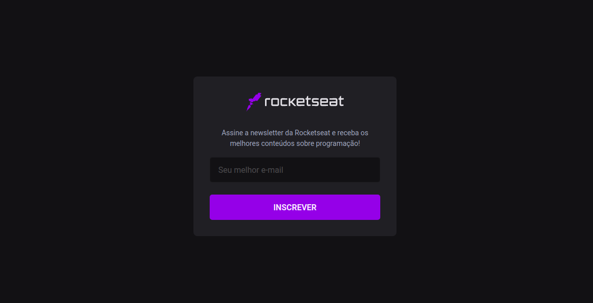

<br>
<div align="center">
  <h4 align="center">
     Next.js, subscribe feature using Serverless Function + MongoDB
  </h4>
</div>

---

<p align="center">
  
</p>


## 🚀 Getting started

To clone and run the application, you will need to have [Git](https://git-scm.com), [Node.js](https://nodejs.org) + [Yarn](https://yarnpkg.com) installed on your machine. With all programs installed, run the following command lines:


```bash
# Clone this repository
$ git clone https://github.com/nickcarva/nextjs-serverless

# Access the repository
$ cd nextjs-serverless

# Install the dependencies
$ yarn install

# Run application
$ yarn dev
```


